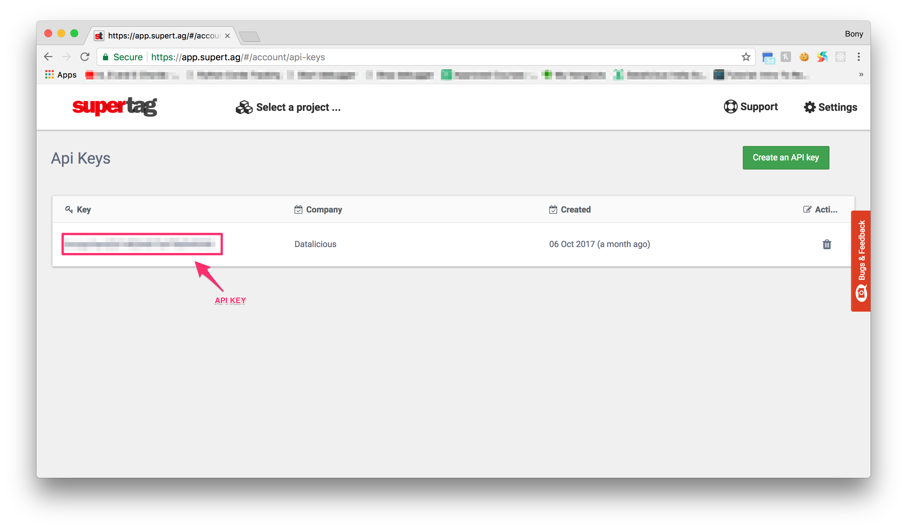
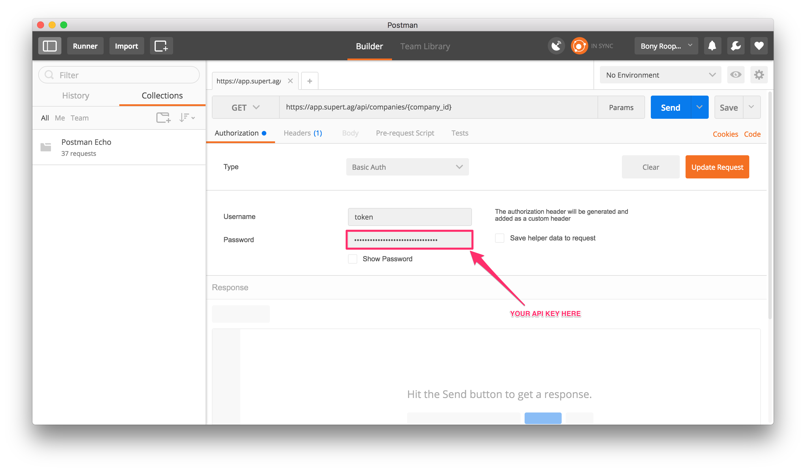

# superTagAPIExamples
SuperTag has great API, this repository contains some examples of how to use superTag in order to get most.

### Creating your first API Key:
* Go to SuperTag Dashboard and go to Settings -> Api Keys.
* Click on Create and API key.

### Making requests through Postman:
* SuperTag uses Basic Authentication to authenticate the API requests.
* For Basic Authentication to work, please set username as `token` and password as your API Key.

